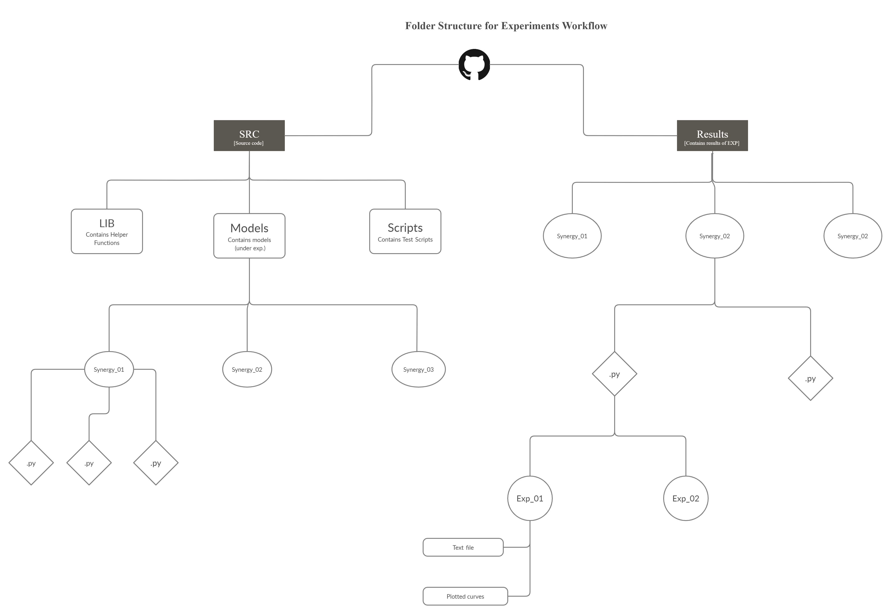

# Deep_Nets_experiments

For Rigorous experimentation of new ideas of Deep learning in context of computer Vision

The idea is to come up with a novel architecture based on attention.

## Papers

[Stand-alone-self-attention]

[CBAM](https://arxiv.org/abs/1807.06521)

[SE Nets](https://arxiv.org/abs/1709.01507)

[ECA Nets](https://arxiv.org/abs/1910.03151)

[Augumented Attention](https://arxiv.org/abs/1904.09925)

## Updates

## Todo

## File Structure

